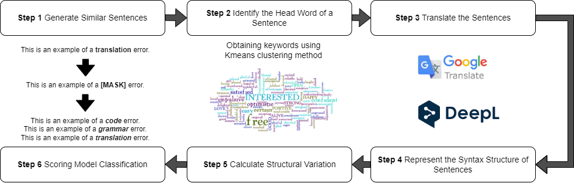
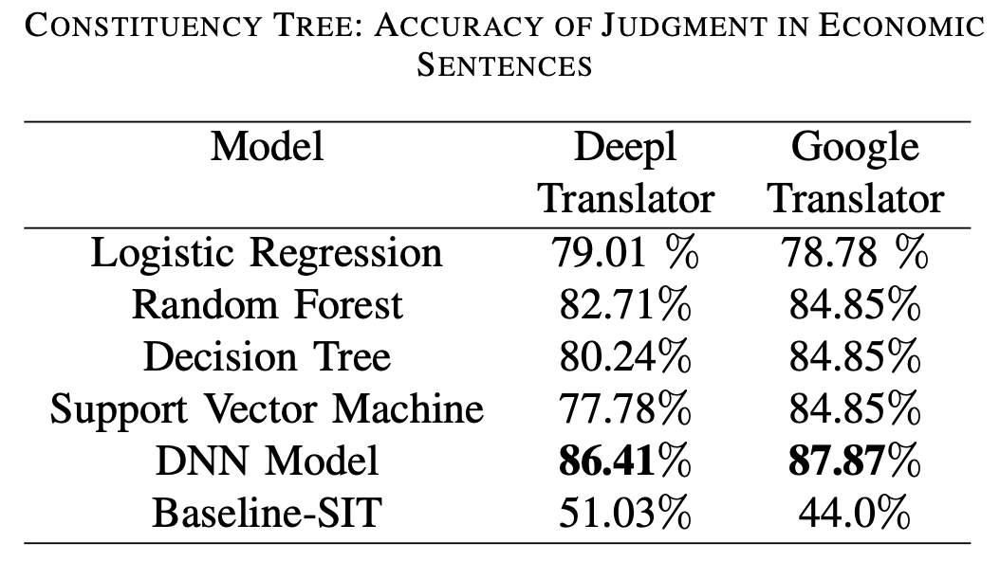
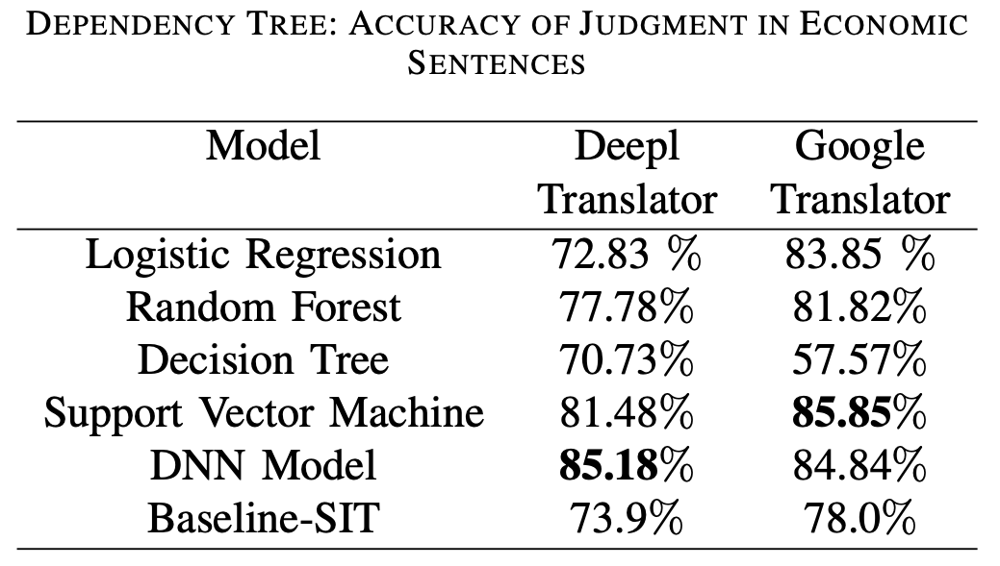
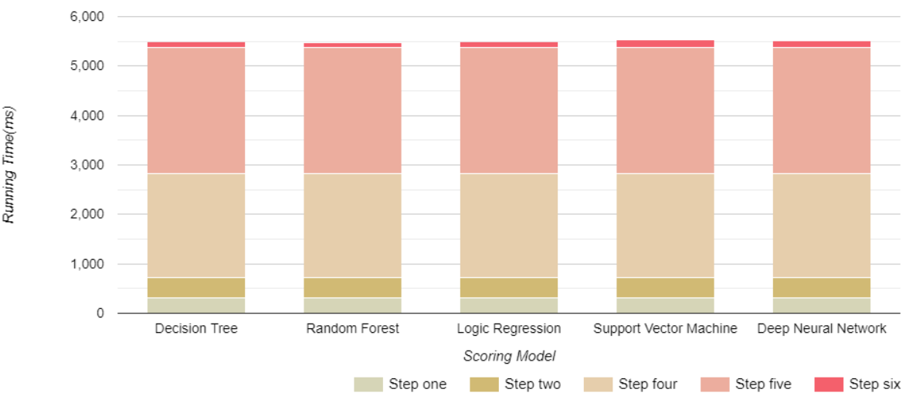

### StructureTester: Automatic Machine Translation Testing Based on Variation Feature Vector

#### Author: Wei Luo, Yemao Luo, Yao Li, Tao Zhang*

[QRS 2023: International Conference on Software Quality, Reliability and Security](https://qrs23.techconf.org/)

---

#### Overview:

#### Steps to run:

1. Prepare the environment
   1. The easier way
      1. Install [Docker](https://docs.docker.com/get-docker/)
      2. Pull the image from [docker hub](https://hub.docker.com/r/yemaoluo/structuretester) using command **docker pull
         yemaoluo/structuretester** or download the image
         from [Github](https://github.com/StructureTester/StructureTester/releases/tag/StructureTester_Docker_image)
      3. Run the image
   2. The harder way
      1. Install [Jdk8](https://openjdk.org/install/) on your device
      2. Install [Python 3.10](https://www.python.org/downloads/) on your device
      3. Download [CoreNLP](https://stanfordnlp.github.io/CoreNLP/) on your device and move it to StructureTester folder
      4. Use command **pip install -r requirements.txt** to install the required python packages

2. Start CoreNLP server enter CoreNLP directory and use command **nohup java -mx4g -cp "*"
   edu.stanford.nlp.pipeline.StanfordCoreNLPServer -port 9000 -timeout 15000 > /dev/null 2>&1 &** to start the server

3. To run Demo enter command **python3 StructureTester.py --mode=demo** and wait for the result

4. To run StructureTester in normal mode enter command **python3 StructureTester.py --mode=demo**

#### Performance evaluation:

1. Accuracy of Consistency Tree

   

2. Accuracy of Dependency Tree

   

3. Time cost

   

##### @CopyRight: Yemao Luo, 6th, August, 2023 :)
